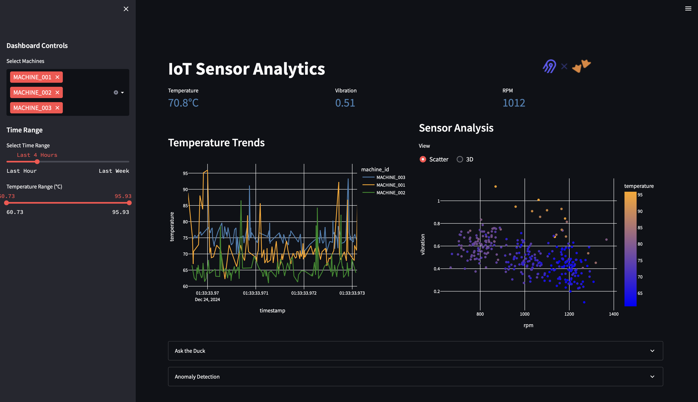
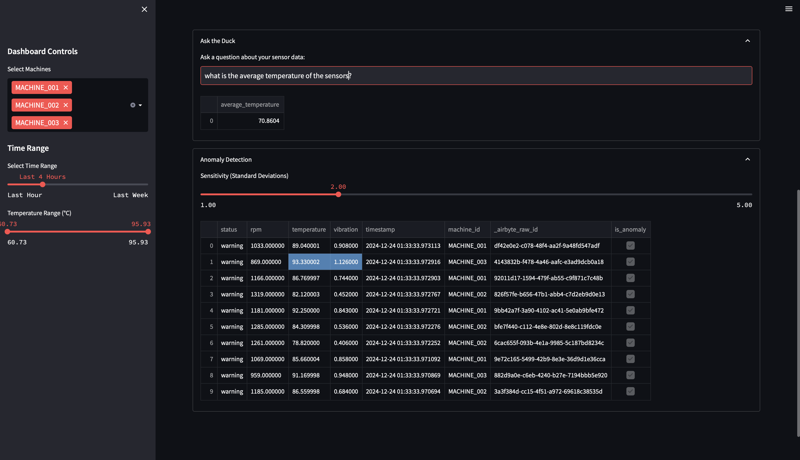

# Industrial IoT Analytics Platform

<div align="center">
  
</div>

Industrial IoT sensor monitoring and analytics platform demonstrating modern data stack integration using FastAPI, Airbyte, and MotherDuck.

## Technical Implementation
The solution simulates an industrial IoT environment where sensor data is collected and analyzed in mini batches:

- **Edge Layer**: FastAPI simulates IoT sensors, generating realistic machine data (temperature, vibration, RPM) with configurable anomaly rates
- **Ingestion**: Airbyte Cloud handles real-time data ingestion from the API endpoint
- **Storage & Analytics**: MotherDuck (DuckDB) provides cloud data warehouse capabilities with natural language querying
- **Visualization**: Streamlit powers an interactive monitoring dashboard

In production environments, data would typically flow through MQTT protocols via edge gateways into cloud message brokers (like AWS IoT Core or Azure IoT Hub) for buffering before ingestion. This demo simplifies the architecture while maintaining realistic data patterns and API-based ingestion. ngrok provides a public endpoint for the local FastAPI server.

## Demo
[Watch the full video demo on Loom](https://www.loom.com/share/8ad5e0c6e913497cbbe9433946669ba0)

## Dashboard Preview
<div align="center">
  
  
</div>

## Dataset
The simulated industrial IoT dataset includes:
- 5 unique machines with distinct baseline characteristics
- Real-time sensor readings:
  - Temperature (°C)
  - Vibration (mm/s)
  - RPM
- 5% anomaly injection rate
- Machine status tracking (normal/warning)
- Time-series data with millisecond precision

## Setup Instructions
### Prerequisites
- Python 3.9+
- ngrok account
- Airbyte Cloud account
- MotherDuck account

### Environment Setup
```bash
# Create conda environment
conda create -n iot-dashboard python=3.9
conda activate iot-dashboard

# Install dependencies
pip install -r requirements.txt
```

Create a `.env` file:
```env
# For Airbyte connection
MOTHERDUCK_TOKEN_AIRBYTE=your_token_here

# For Streamlit dashboard
MOTHERDUCK_TOKEN_STREAMLIT=your_token_here
```

### Running the Application
1. Start FastAPI Simulator:
```bash
python edge_gateway.py
```

2. Create ngrok tunnel:
```bash
ngrok http 8001
```

3. Configure Airbyte:
   - Create custom HTTP source using ngrok URL
   - Set MotherDuck as destination
   - Configure sync frequency (minimum 60 minutes for cloud)

4. Launch dashboard:
```bash
streamlit run app.py
```

## Database Schema
```sql
CREATE TABLE sensor_data_flattened (
    rpm FLOAT,
    temperature FLOAT,
    vibration FLOAT,
    timestamp TIMESTAMP,
    machine_id VARCHAR,
    status VARCHAR,
    *airbyte*raw_id VARCHAR
);
```

## MotherDuck Share
```sql

-- Run this snippet to attach database
ATTACH 'md:_share/AirQuacks-Innovation-Lab-Hackathon/201a2473-a1f2-462d-8233-9012007e008a';

```


## AI Tools Used
- Claude (Anthropic) as development copilot
- Perplexity for technical research and documentation

## Features
- Real-time sensor monitoring
- Automated data ingestion
- Interactive analytics dashboard
- Natural language querying
- Anomaly detection
- Time-series visualizations

## Future Enhancements
- MQTT protocol integration
- ML anomaly detection
- Predictive maintenance
- Additional sensor types

## Contributing
Feel free to submit issues and enhancement requests!